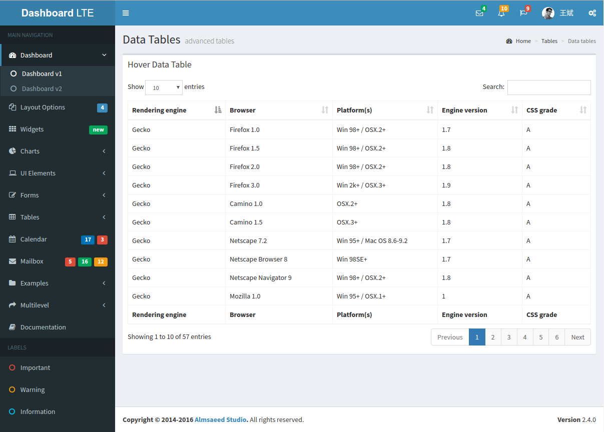

# express-admin

一个基于NodeJS Express框架的后台管理系统，包括登录，角色，菜单权限等。
redis: v3.0+

# Todo List

- [X] 用户登录
- [X] 用户管理
- [ ] 菜单管理
- [ ] 权限管理
- [ ] 数据库整理
- [ ] 用户角色管理
- [ ] 菜单权限管理
- [ ] 操作权限管理

# 界面预览

1.登录
--

2.首页
