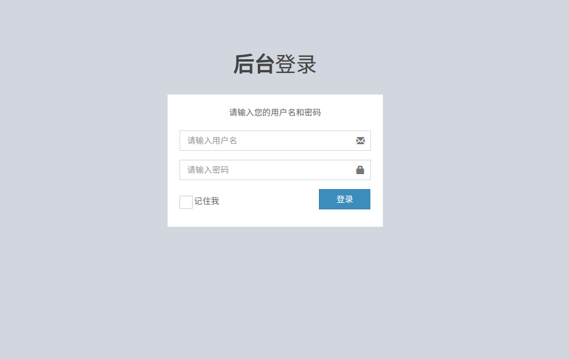
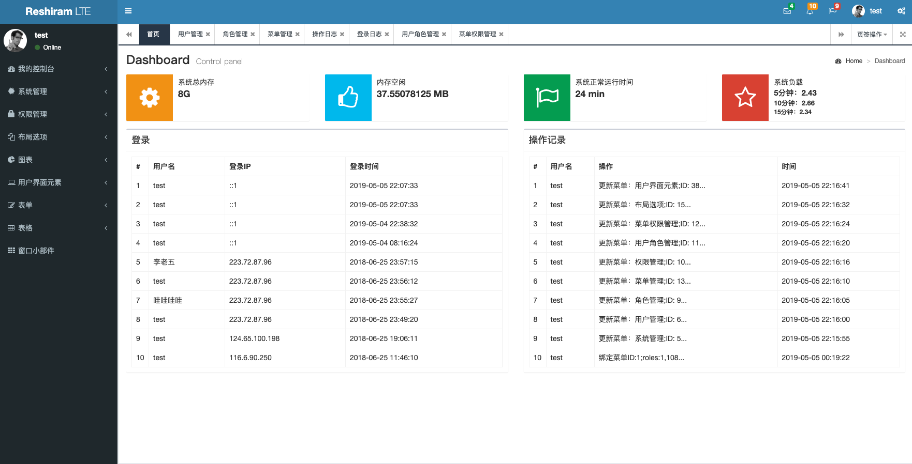
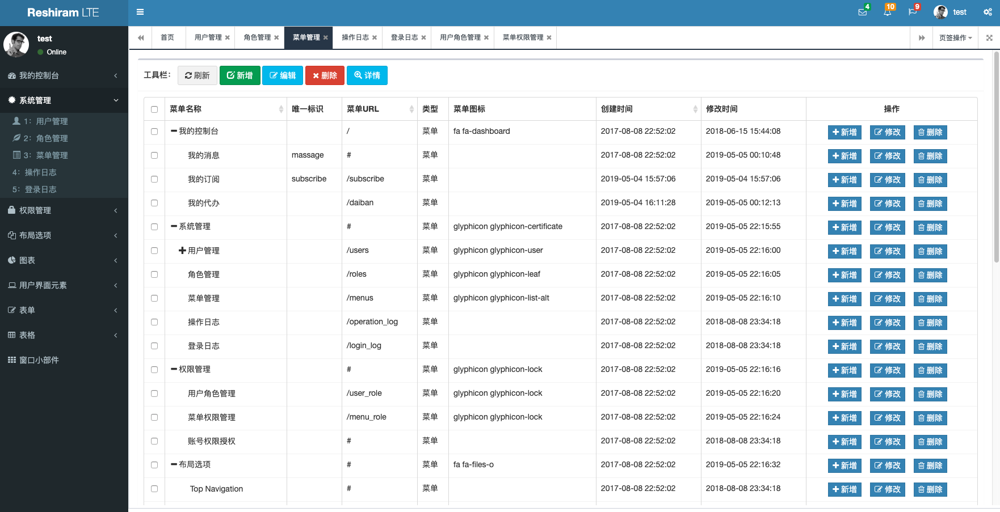
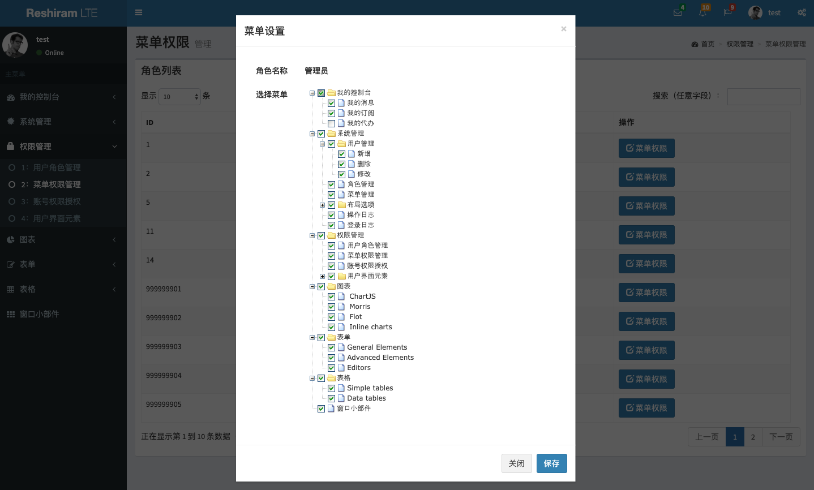

# express-admin
```
一个基于NodeJS Express Bootstrap 框架的后台管理系统，包括登录，角色，菜单权限等。
redis: v3.0+, 
nodejs: v8.0+
```
# 下载地址
https://github.com/wangbinlml/express-admin

# Demo地址

http://a.chenxun.org
username: test
password: test


# 安装
```
git clone https://github.com/wangbinlml/express-admin.git
cd express-admin
npm install 
打开浏览器访问：http://127.0.0.1:3000  （3000端口可在system_config.json中配置）

注：图片验证码使用canvas；安装请参考官网教程（https://github.com/Automattic/node-canvas）
```
#配置数据库
```
{
  "mysql": {
    "host": "127.0.0.1",
    "user": "root",
    "password": "",
    "database": "demo",
    "port": 3306,
    "connectionLimit": 50,
    "acquireTimeout": 10000,
    "charset": "utf8"
  },
  "redis": {
    "cluster": false,
    "connect_info": [
      {
        "port": 6379,
        "host": "127.0.0.1"
      }
    ]
  }
}
```
#数据库文件
```
db/db.tar.gz
db/change.sql
```
# Todo List
- [X] 用户登录
- [X] 登录验证码
- [X] 用户管理
- [x] 菜单管理
- [x] 权限管理
- [x] 用户角色管理
- [x] 菜单权限管理
- [x] 实例数据库
- [x] 菜单管理加入table tree
- [x] 权限设置加入ztree
- [x] 菜单以tab方式打开，可以同时展示多个页面
- [ ] 操作权限管理

# 界面预览

1.登录
--


1.首页
--


3.菜单管理
--


4.权限设置
--


